# World Wise

World Wise is an interactive application built using Leaflet that fetches data from an external API. With this application, you can log all your trips and record information about the places you have visited.

## Features

- Interactive Maps: Display locations using Leaflet.
- Trip Logging: Record places visited and add notes.
- Routing: Implemented with React Router, including nested routes, dynamic routes, useSearchParams, and useNavigate.
- State Management: Managed with Context API to avoid prop drilling.
  This template provides a minimal setup to get React working in Vite with HMR and some ESLint rules.
- using fake authentication

## image

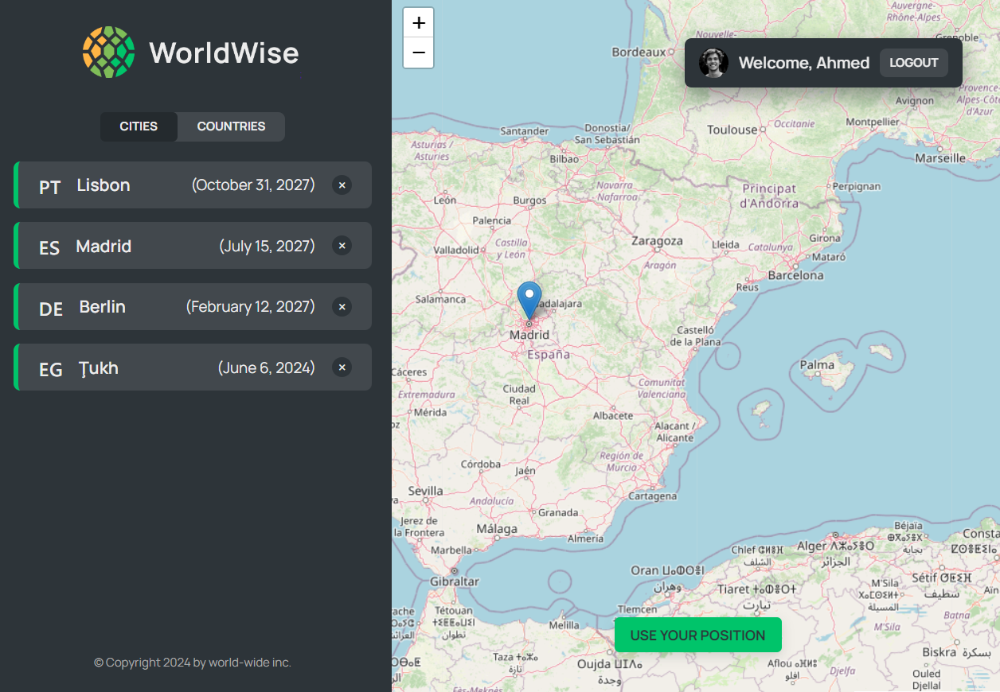
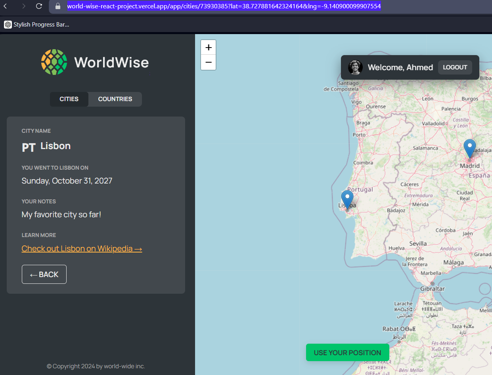
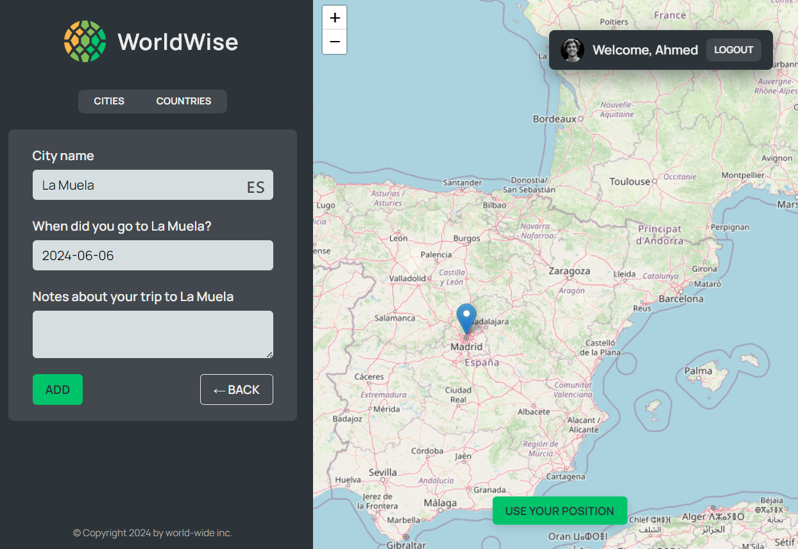
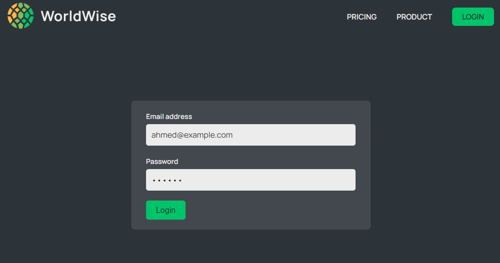

## Responsive Design

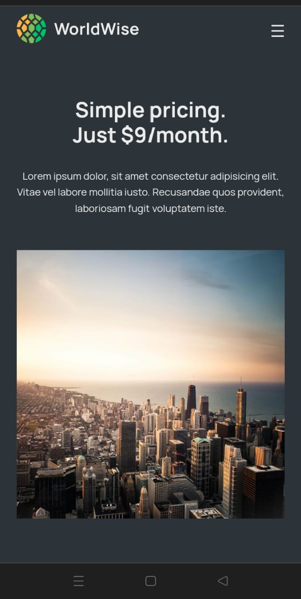

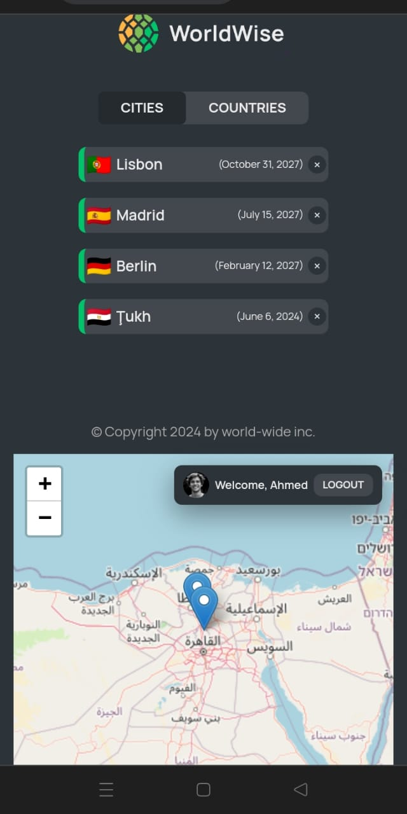
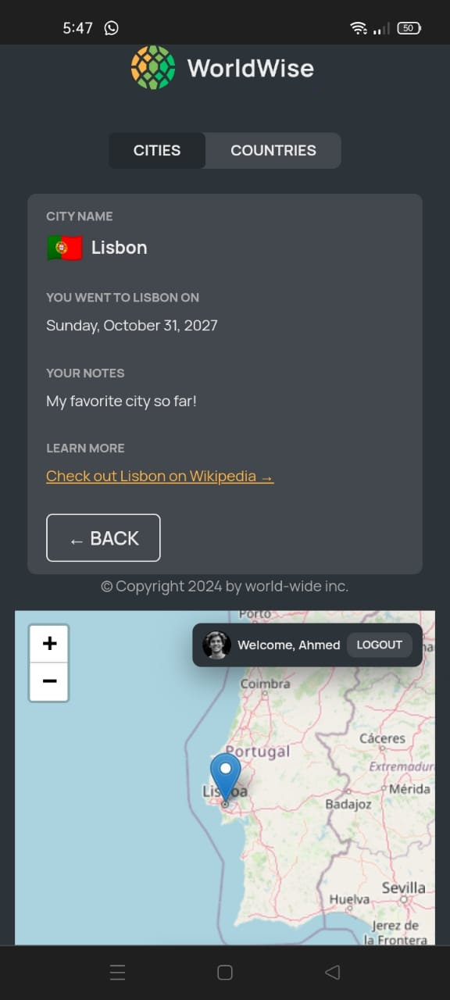
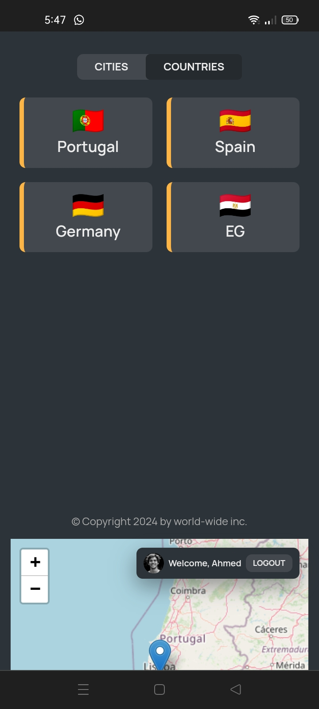
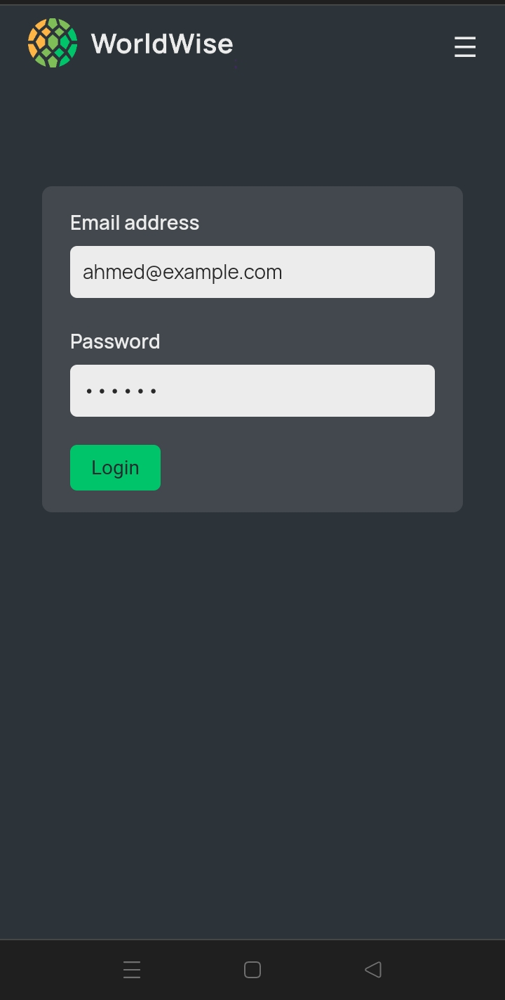
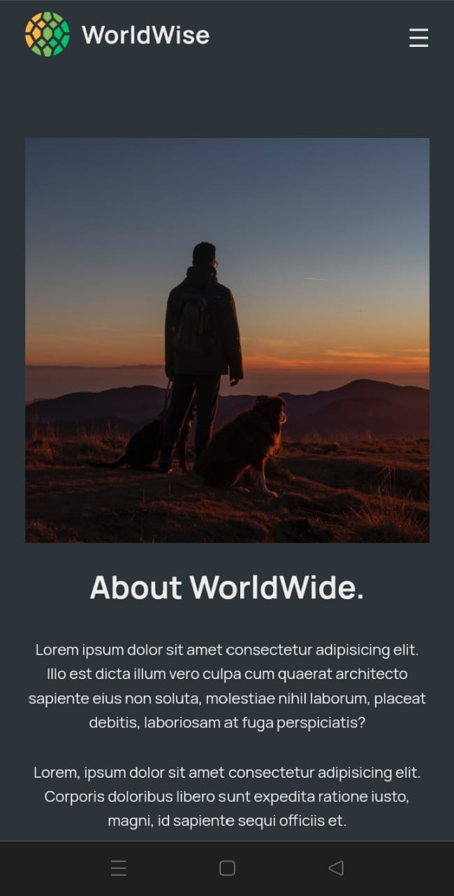
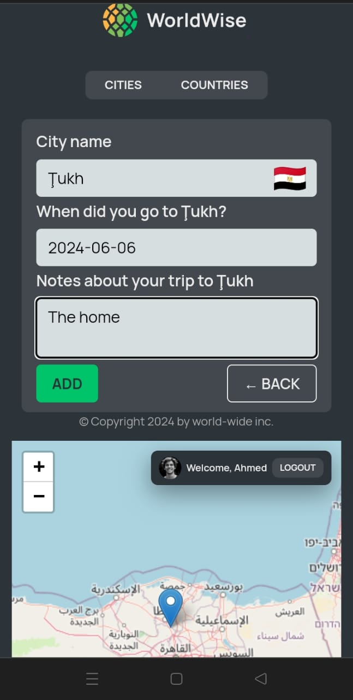
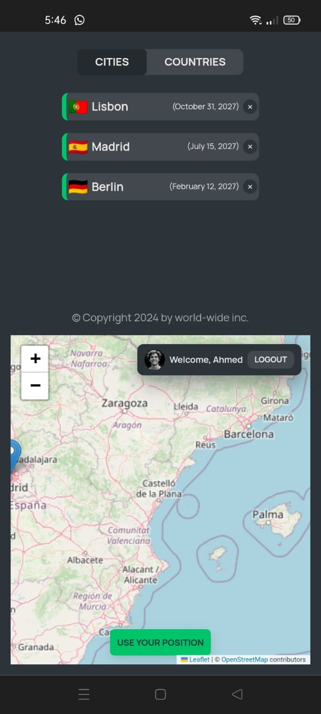

Currently, two official plugins are available:

- [@vitejs/plugin-react](https://github.com/vitejs/vite-plugin-react/blob/main/packages/plugin-react/README.md) uses [Babel](https://babeljs.io/) for Fast Refresh
- [@vitejs/plugin-react-swc](https://github.com/vitejs/vite-plugin-react-swc) uses [SWC](https://swc.rs/) for Fast Refresh
